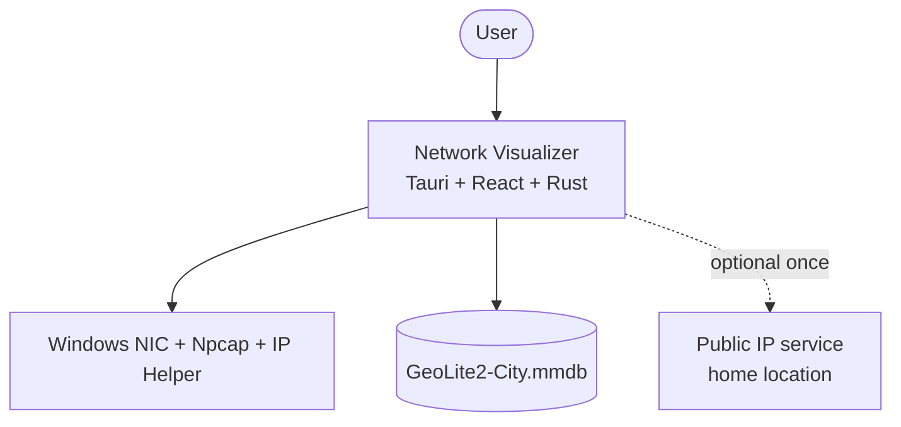
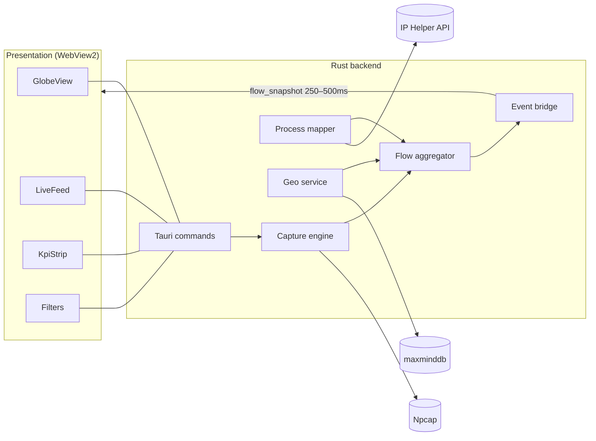
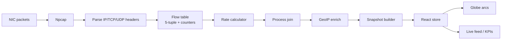
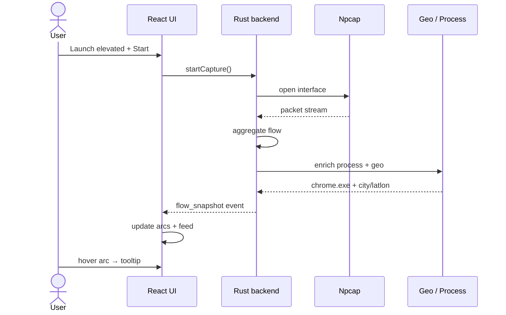
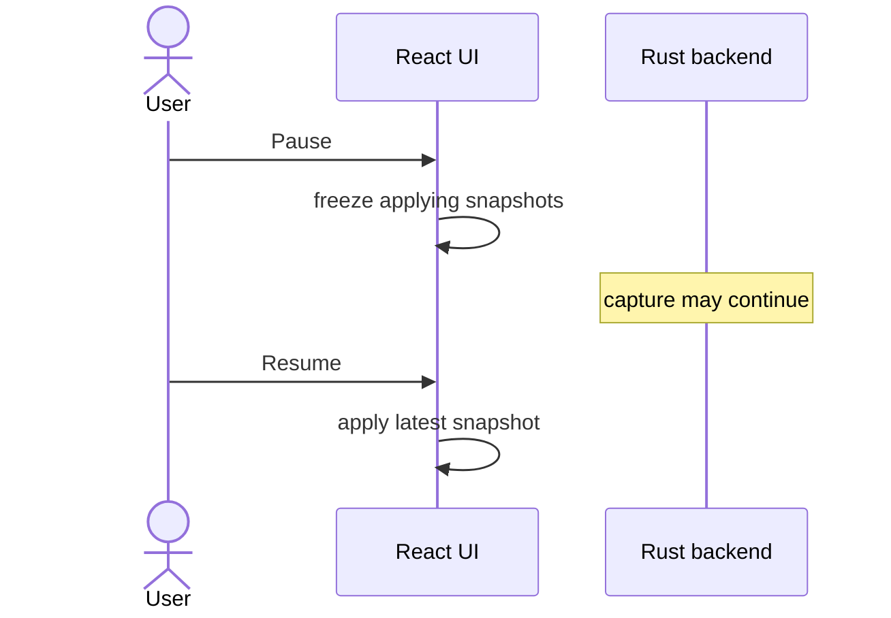

# Network Visualizer

### See where every connection from your PC goes — on a living 3D globe.

[](#system-requirements)
[](#tech-stack)
[](#architecture)
[](docs/00-DOCUMENT-INDEX.md)
[](#project-status)

**Network Visualizer** is a Windows desktop dashboard that captures your machine’s network traffic, attributes it to processes, geolocates destinations, and draws **silky animated arcs** from your location to the world.

> Local-first. Ops-center aesthetic. Built for clarity — not for dumping raw PCAP into your eyeballs.

---

## Table of contents

- [Features](#features)
- [Screenshots / UI layout](#screenshots--ui-layout)
- [System architecture](#system-architecture)
- [System design](#system-design)
- [Data pipeline](#data-pipeline)
- [Sequence flows](#sequence-flows)
- [Tech stack](#tech-stack)
- [Repository structure](#repository-structure)
- [Documentation suite](#documentation-suite)
- [Getting started](#getting-started)
- [Configuration](#configuration)
- [Security & privacy](#security--privacy)
- [Roadmap](#roadmap)
- [Contributing](#contributing)
- [License](#license)

---

## Features

| Capability | Description |
|------------|-------------|
| **Full traffic capture** | Npcap-based packet capture with header-only parsing (TCP/UDP) |
| **Flow aggregation** | 5-tuple flows with bytes, packets, and live rates |
| **Process attribution** | Map sockets → PID → process name via Windows IP Helper |
| **Offline GeoIP** | MaxMind GeoLite2-City → city, country, coordinates |
| **3D globe dashboard** | `react-globe.gl` arcs, pulses, idle auto-rotate |
| **Live ops panels** | KPIs, filters, feed, pinned detail, bottom charts |
| **Local-first privacy** | No payload storage by default; no cloud telemetry in v1 |

---

## Screenshots / UI layout

> *Screenshots will be added after Phase 1 (globe visual spike). Layout contract:*

```text
┌────────────────────────────────────────────────────────────────────┐
│  NETWORK VISUALIZER              ● LIVE          [Pause] [Settings]│
├──────────────┬───────────────────────────────────┬─────────────────┤
│  KPIs        │                                   │  Live feed      │
│  Active flows│         3D WORLD GLOBE            │  process · IP   │
│  Mbps ↑ ↓    │     home ──animated arc──► dest   │  city · rate    │
│              │                                   │                 │
│  Filters     │      destination pulses           │  Flow detail    │
│  process     │      drag to orbit                │  (pinned)       │
│  country     │                                   │                 │
│  TCP/UDP     │                                   │                 │
├──────────────┴───────────────────────────────────┴─────────────────┤
│  Top processes  │  Top countries  │  Throughput sparkline          │
└────────────────────────────────────────────────────────────────────┘
```

**Visual language:** deep navy/black base, cyan–violet accents, frosted glass panels, monospace for IPs/ports, smooth list motion.

---

## System architecture

### High-level context



### Container view



### Layered architecture

| Layer | Responsibility |
|-------|----------------|
| **Presentation** | 3D globe, dashboard chrome, filters, motion |
| **Application** | Tauri commands/events, settings, capture lifecycle |
| **Domain** | Flows, rates, enrichment rules, private-IP policy |
| **Infrastructure** | Npcap, IP Helper, mmdb file, optional HTTP for public IP |

---

## System design

### Core components

| Component | Responsibility |
|-----------|----------------|
| **Capture Engine** | Open interface, read packets, parse L3/L4 headers |
| **Flow Aggregator** | Merge into 5-tuple table; bytes/rates; expiry |
| **Process Mapper** | Poll TCP/UDP owner tables; join by local endpoint |
| **Geo Service** | Offline IP→location; home origin; session cache |
| **Event Bridge** | Emit compact snapshots to the UI |
| **UI Store** | Zustand (or equivalent); pause; client filters |

### Design principles

1. **Never push per-packet events to React** — snapshot deltas only.  
2. **Capture off the UI thread** — privilege work stays in Rust.  
3. **Header-only by default** — privacy and performance.  
4. **Render top-N arcs** — beauty without melting the GPU.  
5. **Degrade gracefully** — missing Npcap/admin → clear UX (connection-table fallback when feasible).

### Key ADRs

| ID | Decision |
|----|----------|
| ADR-001 | Tauri 2 over Electron |
| ADR-002 | Full Npcap capture primary; connection-table fallback secondary |
| ADR-003 | 3D globe as default visualization |
| ADR-004 | Offline GeoLite2 over online-only geo APIs |
| ADR-005 | Snapshot IPC (not per-packet) |

Full design narrative: [`docs/03-system-architecture-design.md`](docs/03-system-architecture-design.md)

---

## Data pipeline



### Flow record (logical model)

```text
Flow {
  flow_id, protocol,
  src_ip, src_port, dst_ip, dst_port,
  bytes_up, bytes_down, packets, rate_bps,
  pid?, process_name?,
  remote_city?, remote_country?, remote_lat?, remote_lon?,
  first_seen, last_seen, is_private_remote
}
```

---

## Sequence flows

### Start capture & draw first arc



### Pause behavior



---

## Tech stack

| Area | Technology |
|------|------------|
| Desktop shell | **Tauri 2** |
| UI | **React 18**, **TypeScript**, **Vite** |
| Globe | **react-globe.gl** (Three.js) |
| Motion | Framer Motion + CSS |
| Capture | **Npcap** + Rust `pcap` |
| Parse | `etherparse` / `pnet_packet` |
| Process map | Windows **IP Helper** via `windows` crate |
| GeoIP | **maxminddb** + GeoLite2-City |
| State | Zustand (planned) |

---

## Repository structure

```text
Network_Visualizer/
├── README.md                 ← you are here
├── docs/
│   ├── 00-DOCUMENT-INDEX.md
│   ├── 01-project-proposal.md
│   ├── 02-software-requirements-specification.md
│   ├── 03-system-architecture-design.md
│   ├── 04-project-plan-roadmap.md
│   ├── 05-risk-security-privacy.md
│   └── export/               ← DOCX + PDF package
├── src-tauri/                ← Rust backend (to be scaffolded)
├── src/                      ← React frontend (to be scaffolded)
├── diagrams/                 ← optional static diagram assets
└── scripts/                  ← doc generation helpers
```

---

## Documentation suite

Enterprise-style project documentation lives under [`docs/`](docs/00-DOCUMENT-INDEX.md):

| Doc | Description |
|-----|-------------|
| [Project Proposal & Business Case](docs/01-project-proposal.md) | Problem, value, scope, success criteria |
| [Software Requirements Specification](docs/02-software-requirements-specification.md) | Functional / NFR / acceptance |
| [System Architecture & Design](docs/03-system-architecture-design.md) | Components, IPC, ADRs |
| [Project Plan & Roadmap](docs/04-project-plan-roadmap.md) | Phases, WBS, QA checklist |
| [Risk, Security & Privacy](docs/05-risk-security-privacy.md) | Risk register, STRIDE-lite, privacy |

**Export package (DOCX + PDF):** [`docs/export/`](docs/export/)

| File | Format |
|------|--------|
| `Network_Visualizer_Project_Documentation_Package.docx` | Word |
| `Network_Visualizer_Project_Documentation_Package.pdf` | PDF |

Regenerate exports:

```bash
node scripts/generate-project-docs.mjs
# then convert DOCX → PDF (LibreOffice), or use the script’s PDF step if configured
```

---

## Getting started

### System requirements

- Windows 10 (22H2+) or Windows 11, **x64**
- [WebView2](https://developer.microsoft.com/microsoft-edge/webview2/) (usually preinstalled)
- [Npcap](https://npcap.com/) (for full traffic capture)
- **Administrator** rights to capture
- Rust stable + Node.js 20+ (development)
- GeoLite2-City `.mmdb` (MaxMind free account; see license)

### Development

```bash
# install frontend deps
npm install

# desktop app (recommended)
npm run tauri dev

# UI only in browser (demo traffic, no OS capture)
npm run dev
```

### Modes at runtime

| Mode | When |
|------|------|
| **Demo** | Settings → Demo mode, or browser-only `npm run dev` |
| **Connections (degraded)** | Default live path: Windows TCP table + process names + geo |
| **Capture-ready** | Admin + Npcap present (status flags surface this) |

### End-user prerequisites

1. Install Npcap (WinPcap API-compatible mode recommended when prompted).  
2. Obtain GeoLite2-City database per MaxMind terms; configure path in Settings / first-run.  
3. Run Network Visualizer **as Administrator**.  
4. Start capture → browse the web → watch the globe.

---

## Configuration

| Setting | Purpose | Default (planned) |
|---------|---------|-------------------|
| Capture interface | Which NIC to sniff | Primary active |
| Idle flow expiry | Drop quiet flows | 45s |
| Arc top-N | Max arcs rendered | 80 |
| Home location | Arc origin | Public IP geo / override |
| Geo DB path | `.mmdb` location | User-selected |
| Snapshot interval | UI refresh | 250–500 ms |

---

## Security & privacy

- **No application payloads** stored by default — headers and counters only.  
- **No cloud telemetry** in v1.  
- Capture requires elevation because Windows packet capture is privileged.  
- Optional public-IP lookup is used only to place “home” on the map; override manually anytime.  
- Do **not** commit GeoIP databases or sensitive PCAPs to git.

Details: [`docs/05-risk-security-privacy.md`](docs/05-risk-security-privacy.md)

---

## Roadmap

```mermaid
gantt
  title Network Visualizer v1 roadmap
  dateFormat  X
  axisFormat  %s
  section Foundation
  Phase 0 Scaffold           :a1, 0, 1
  section Experience
  Phase 1 Globe mock         :a2, 1, 2
  section Data plane
  Phase 2 Capture engine     :a3, 2, 4
  Phase 3 Enrichment         :a4, 4, 3
  section Integration
  Phase 4 Live wiring        :a5, 6, 3
  Phase 5 Polish and ship    :a6, 8, 3
```



| Phase | Outcome |
|-------|---------|
| **0** | Premium empty dashboard shell |
| **1** | Cinematic globe with mock arcs |
| **2** | Live capture + flow rates |
| **3** | Process + GeoIP enrichment |
| **4** | Real traffic paints the dashboard |
| **5** | Wizard, installer, QA |

Post-v1 ideas: flow history, first-class degraded mode, PCAP export, multi-platform experiments.

---

## Contributing

1. Read the [document index](docs/00-DOCUMENT-INDEX.md) and [architecture](docs/03-system-architecture-design.md).  
2. Keep changes scoped; match dark glass UI language.  
3. Never add payload capture or default telemetry without an explicit design ADR.  
4. Prefer conventional commits (`feat:`, `fix:`, `docs:`).  

---

## Project status

| Area | Status |
|------|--------|
| Product vision | ✅ Locked |
| Corporate documentation (10 docs + exports) | ✅ Complete |
| README / architecture diagrams | ✅ Complete |
| App scaffold (Tauri 2 + React + TS) | ✅ Complete |
| 3D globe dashboard UI | ✅ Complete |
| Connection-table engine + process map | ✅ Complete |
| Geo enrich (mmdb + HTTP fallback) | ✅ Complete |
| Demo mode + first-run wizard + settings | ✅ Complete |
| Npcap full packet path | ⚙️ Detected/flagged; connection-table + rates primary in v1 runtime |

---

## License

License TBD (recommended: MIT or Apache-2.0 for code).  
Third-party: Npcap and MaxMind GeoLite2 have **separate** terms — do not bundle them in violation of their licenses.

---

<p align="center">
  <b>Network Visualizer</b> — from socket to city, in one glance.<br/>
  <sub>Built with Tauri · React · Rust · a little bit of cartographic drama</sub>
</p>
